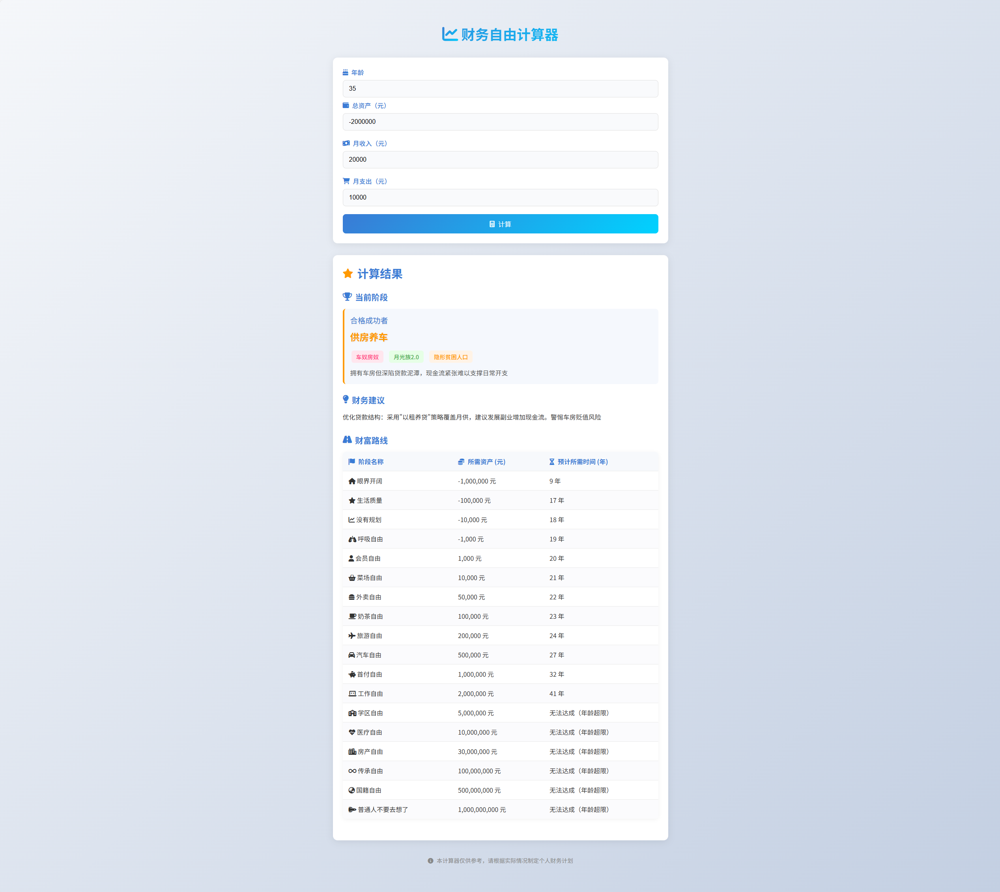

# Wealth Freedom Calculator

A simple web application to help users calculate and plan for financial independence.

## Features
- Interactive financial inputs
- Real-time wealth freedom calculations
- Visual progress tracking
- Savings goal recommendations

## Technologies Used
- HTML5
- CSS3 (Responsive Design)
- JavaScript (ES6+)

## How to Use
1. Open https://wealth-freedom.vercel.app in your browser
2. Input your current savings, monthly expenses, and income
3. View your wealth freedom timeline and recommendations

## Preview
 *Example interface (if available)*

## Contributing
Contributions are welcome! Please open an issue or submit a pull request.
