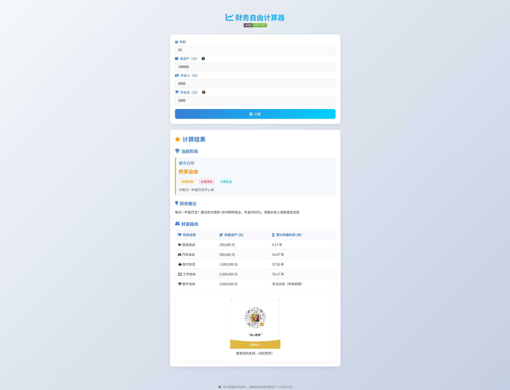

# 财富自由计算器

一个有趣的网络应用，帮助用户探索自己在财富自由之路上的位置和未来规划。从"吃土青年"到"隐形富豪"，看看你处于哪个阶段？

## 核心功能
- 📊 财富阶段诊断：基于净资产快速定位你的财务状态
- 🎯 未来规划：计算达到下一个财富阶段所需时间
- 💡 个性化建议：根据当前阶段提供实用的理财建议
- 🏷️ 趣味标签：为每个阶段提供形象的特征标签

## 财富阶段示例
- 🌱 呼吸自由 (-1000元) - 勉强维持基本生存
- 🥤 奶茶自由 (10万元) - 可以随心购买星巴克
- 🚗 汽车自由 (50万元) - 可全款购置中高端汽车
- 🏠 房产自由 (3000万元) - 在北上广深持有多套房产
- 🌍 国籍自由 (5亿元) - 实现资产全球化配置
...更多有趣阶段等你探索

## 技术栈
- HTML5 + CSS3 响应式设计
- JavaScript ES6+
- JSON 动态财富阶段数据

## 使用方法
1. 访问：https://wealth-freedom.vercel.app
2. 输入：年龄、净资产、月收入和支出
3. 获取：当前财富阶段、发展建议和未来规划

## 预览

## 特别说明
本应用采用轻松幽默的方式展示财富规划，计算结果仅供参考娱乐。真实理财建议请咨询专业理财顾问。